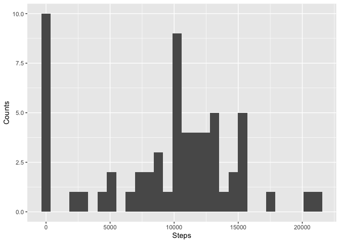
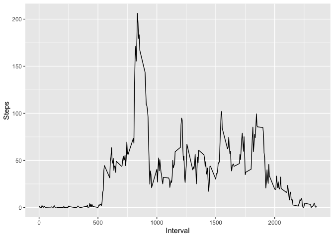
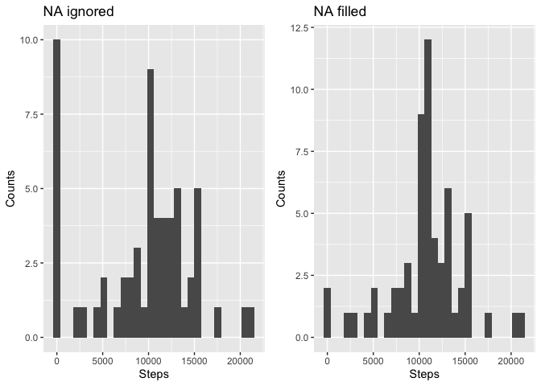
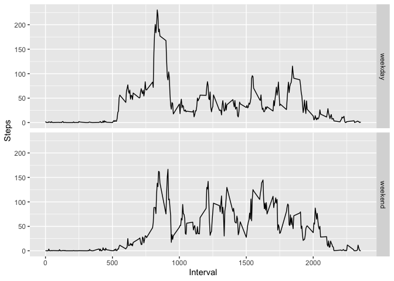

## Loading and preprocessing the data
Data loading and converting `date` variable to date format.

```r
data <- read.csv('activity.csv',col.names = c('steps','date','interval'),
                 na.strings = 'NA')
data <- tbl_df(data)
data <- mutate(data, date = as.Date(date,'%Y-%m-%d'))
data
```

```
## # A tibble: 17,568 x 3
##    steps date       interval
##    <int> <date>        <int>
##  1    NA 2012-10-01        0
##  2    NA 2012-10-01        5
##  3    NA 2012-10-01       10
##  4    NA 2012-10-01       15
##  5    NA 2012-10-01       20
##  6    NA 2012-10-01       25
##  7    NA 2012-10-01       30
##  8    NA 2012-10-01       35
##  9    NA 2012-10-01       40
## 10    NA 2012-10-01       45
## # … with 17,558 more rows
```

## What is mean total number of steps taken per day?
Grouping by `date` and getting the total of steps/day.

```r
steps_day <- data %>% 
    group_by(date) %>% 
    summarise(steps = sum(steps,na.rm = TRUE))
```
Making the histogram:

```r
plt1 <- ggplot(steps_day,aes(x = steps)) + 
    geom_histogram() +
    labs(x = 'Steps',y = 'Counts')
print(plt1)
```

<!-- -->

With **mean** 9354.23 and **median** 
10395 steps.

## What is the average daily activity pattern?
Grouping by `interval` and getting the mean of steps/day.

```r
steps_interval <- data %>% 
    group_by(interval) %>% 
    summarise(steps = mean(steps,na.rm = TRUE))
```
Plotting:

```r
plt2 <- ggplot(steps_interval,aes(x = interval,y = steps)) + 
    geom_line() +
    labs(x = 'Interval',y = 'Steps')
print(plt2)
```

<!-- -->

And the 5-minute interval with the **maximum average** of steps is 
835.

## Imputing missing values
The total number of *NA*'s is 2304, filling those 
values with the step's mean for that interval. Creating a new dataset with the *NA*'s
values filled in.

```r
data
```

```
## # A tibble: 17,568 x 3
##    steps date       interval
##    <int> <date>        <int>
##  1    NA 2012-10-01        0
##  2    NA 2012-10-01        5
##  3    NA 2012-10-01       10
##  4    NA 2012-10-01       15
##  5    NA 2012-10-01       20
##  6    NA 2012-10-01       25
##  7    NA 2012-10-01       30
##  8    NA 2012-10-01       35
##  9    NA 2012-10-01       40
## 10    NA 2012-10-01       45
## # … with 17,558 more rows
```

```r
nas = which(is.na(data$steps) == TRUE)
n = length(nas)
for (i in 1:n) {
    j = nas[i]
    data$steps[j] <- steps_interval$steps[which(steps_interval$interval == data$interval[j])]
}
```
Double checking *NA*'s values imputing: 

```r
data
```

```
## # A tibble: 17,568 x 3
##     steps date       interval
##     <dbl> <date>        <int>
##  1 1.72   2012-10-01        0
##  2 0.340  2012-10-01        5
##  3 0.132  2012-10-01       10
##  4 0.151  2012-10-01       15
##  5 0.0755 2012-10-01       20
##  6 2.09   2012-10-01       25
##  7 0.528  2012-10-01       30
##  8 0.868  2012-10-01       35
##  9 0      2012-10-01       40
## 10 1.47   2012-10-01       45
## # … with 17,558 more rows
```
Plotting the histogram:

```r
steps_day <- data %>% 
    group_by(date) %>% 
    summarise(steps = sum(steps))
plt3 <- ggplot(steps_day,aes(x = steps)) + 
    geom_histogram() +
    labs(title= 'NA filled',x = 'Steps',y = 'Counts')
plt1 <-  plt1 + ggtitle('NA ignored')
grid.arrange(plt1, plt3, nrow = 1)
```

<!-- -->

With **mean** 10766.19 and **median** 
10766.19 steps.  
The effect of imputing data is a change in the mean and median of the total steps per day.  

## Are there differences in activity patterns between weekdays and weekends?
Making weekdays factor `weekday` or `weekend`:

```r
data <- mutate(data, day =  tolower(weekdays(data$date)))
data$day <- as.factor(ifelse(data$day=="saturday"|data$day=="sunday","weekend","weekday"))
patterns <- summarise(group_by(data,interval,day),steps = mean(steps))
plt4 <- ggplot(patterns,aes(x=interval,y=steps)) +
    geom_line() +
    facet_grid(day~.) +
    labs(x = 'Interval',y = 'Steps')
print(plt4)
```

<!-- -->
